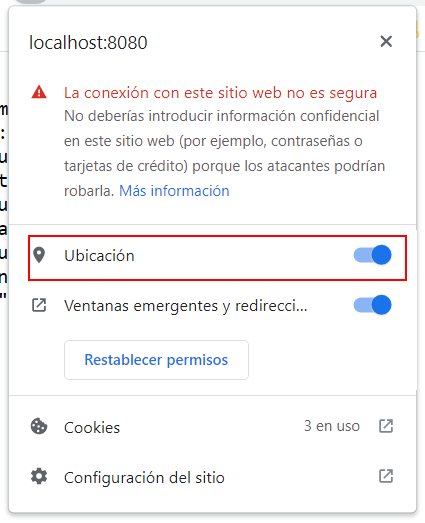

# 06 More hooks

## Resumen

Este ejemplo toma como punto de partida el ejemplo _00-boiler-plate_.

Ahora vamos a utilizar algunos hooks de una librería de tercernos, en concreto [beautiful-react-hooks](https://github.com/antonioru/beautiful-react-hooks) que nos ofrece amplia variedad de hooks interesantes.

## Paso a Paso

- Primero copiamos el ejemplo anterior, y hacemos un _npm install_

```bash
npm install
```

Instalamos [beautiful-react-hooks](https://github.com/antonioru/beautiful-react-hooks)

```bash
npm install beautiful-react-hooks --save

```

Vamos a arrancarlo

```bash
npm start
```

El primer hook que vamos a utilizar es `useAudio`, con él podemos reproducir un fichero de audio desde una URL. Para poder implementar un reproductor de audio a nuestro gusto, ya solamente tendríamos que centrarnos en la parte de la UI, cómo controlar la pista de audio ya nos lo provee la libreria.

_./src/app.tsx_

```diff
import React from "react";
+ import useAudio from "beautiful-react-hooks/useAudio";

export const App = () => {
+ const [state, controls] = useAudio(
+   "https://www.soundhelix.com/examples/mp3/SoundHelix-Song-1.mp3",
+   { autoPlay: true }
+ );

- return <h1>Hello React !!</h1>;
+ return (
+   <>
+     {JSON.stringify(state, null, 2)}
+     <br />
+     <button onClick={controls.play}>Play</button>
+     <button onClick={controls.pause}>Pause</button>
+     <button onClick={() => controls.seek(state.currentTime + 5)}>
+       Jump +5
+     </button>
+   </>
+ );
};

```

En el caso de que queramos hacer una aplicación que soporte modo `Offline`, estaría bien detectar cuando hay algún corte en la red, esta librería nos ofrece un hook simple para ello.

> La implentación que hay por detrás de este hook, se basa en el propio [estándar de JavaScript](https://developer.mozilla.org/en-US/docs/Web/API/Navigator/onLine#listening_for_changes_in_network_status)

_./src/app.tsx_

```diff
import React from "react";
- import useAudio from "beautiful-react-hooks/useAudio";
+ import useOnlineState from "beautiful-react-hooks/useOnlineState";
+ import classes from "./app.css";

export const App = () => {
- const [state, controls] = useAudio(
-   "https://www.soundhelix.com/examples/mp3/SoundHelix-Song-1.mp3",
-   { autoPlay: true }
- );
+ const isOnline = useOnlineState();

- return (
-   <>
-     {JSON.stringify(state, null, 2)}
-     <br />
-     <button onClick={controls.play}>Play</button>
-     <button onClick={controls.pause}>Pause</button>
-     <button onClick={() => controls.seek(state.currentTime + 5)}>
-       Jump +5
-     </button>
-   </>
- );
+ return <div className={isOnline ? classes.online : classes.offline} />;
};

```

Vamos a añadir los estilos:

_./src/app.css_

```css
.online {
  width: 24px;
  height: 24px;
  background-color: green;
}

.offline {
  width: 24px;
  height: 24px;
  background-color: red;
}
```

Para poder simularlo, podemos usar las opciones de la pestaña de _Network_ en las _Dev tools_ del navegador:


Incluso nos ofrece una forma fácil de poder acceder a la geolocalización del usuario. Recuerda que tienes que permitir el accesso a la ubicación en tu navegador:



_./src/app.tsx_

```diff
import React from "react";
- import useOnlineState from "beautiful-react-hooks/useOnlineState";
- import classes from "./app.css";
+ import useGeolocationState from "beautiful-react-hooks/useGeolocationState";

export const App = () => {
- const isOnline = useOnlineState();
+ const { isSupported, isRetrieving, position, onError } = useGeolocationState();

+ onError((error) => {
+   alert(error.message);
+ });

- return <div className={isOnline ? classes.online : classes.offline} />;
+ return (
+   <div>
+     {isRetrieving && <span>Loading Geolocation...</span>}
+     {isSupported && position && (
+       <>
+         <pre>{JSON.stringify(position, null, 2)}</pre>
+       </>
+     )}
+   </div>
+ );
};

```
